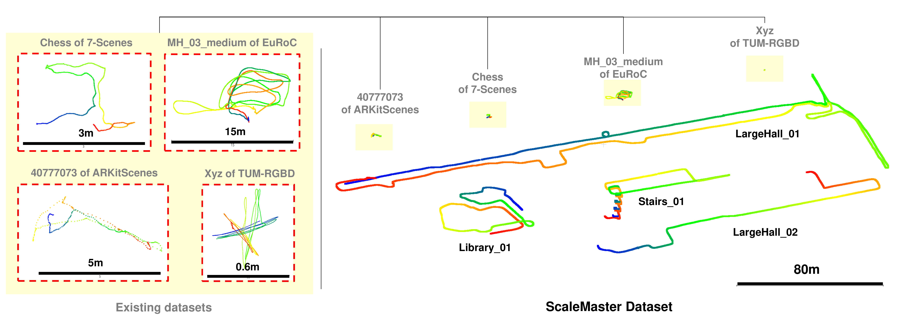
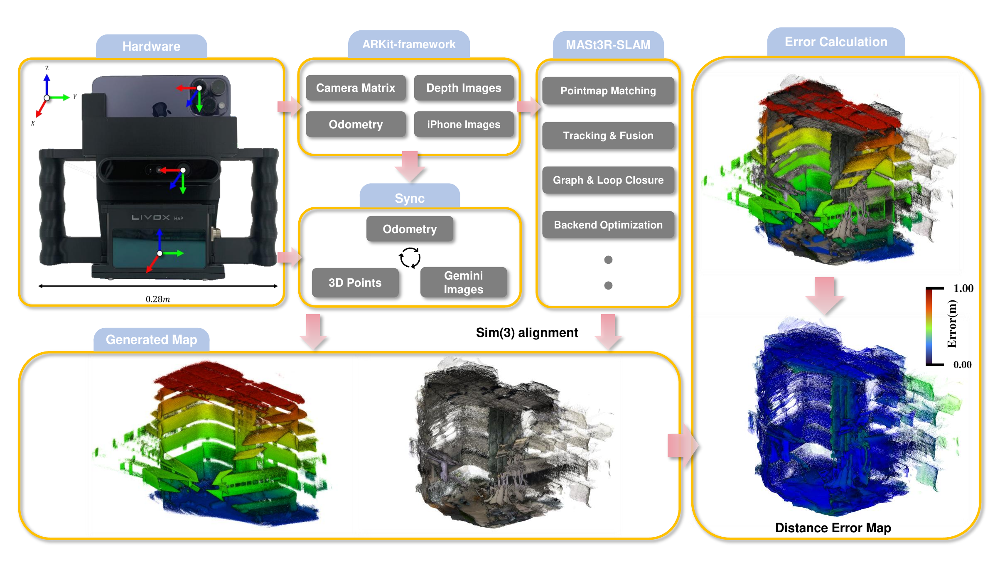

<div align="center">

# ScaleMaster Dataset

### Have We Mastered Scale in Deep Monocular Visual SLAM?

<br>

[](https://scalemaster-dataset.github.io) &nbsp; [](https://arxiv.org/abs/2602.18174) &nbsp; [](https://forms.gle/C7jjz3hiT5JHppJ87)

<br>

[Hyoseok Ju](https://scholar.google.com/citations?user=aYXHS9oAAAAJ&hl=ko) &nbsp;&nbsp; [Bokeon Suh](https://scholar.google.com/citations?user=ZawXymQAAAAJ&hl=ko) &nbsp;&nbsp; [Giseop Kim](https://scholar.google.com/citations?hl=ko&user=9mKOLX8AAAAJ&view_op=list_works&sortby=pubdate)

DGIST, Republic of Korea &nbsp;·&nbsp; ICRA 2026

<br>

</div>

---

## 📄 Abstract

Recent advances in deep monocular visual SLAM have achieved impressive accuracy and dense reconstruction capabilities, yet their robustness to scale inconsistency in large-scale indoor environments remains largely unexplored. Existing benchmarks are limited to room-scale or structurally simple settings, leaving critical issues of intra-session scale drift and inter-session scale ambiguity insufficiently addressed. To fill this gap, we introduce the **ScaleMaster Dataset**, the first benchmark explicitly designed to evaluate scale consistency under challenging scenarios such as multi-floor structures, long trajectories, repetitive views, and low-texture regions. We systematically analyze the vulnerability of state-of-the-art deep monocular visual SLAM systems to scale inconsistency, providing both qualitative and quantitative evaluations. Crucially, our analysis extends beyond traditional trajectory metrics to include a direct map-to-map quality assessment using Chamfer distance against high-fidelity LiDAR reference maps.

---

## 📊 Comparison with Existing Benchmarks

| Dataset | Sequences | Avg. Length | Resolution | Multi-floor & Elevation | Pure Rotation | Complex Indoor | Scale Study |
|---------|-----------|-------------|------------|:---:|:---:|:---:|:---:|
| EuRoC | 11 | 81.2 m | 752×480 | △ | ✓ | ✗ | ✗ |
| TUM-RGBD | ~39 | 12.2 m | 640×480 | ✗ | ✓ | ✓ | ✗ |
| 7-Scenes | 7 | 64.3 m | 640×480 | ✗ | ✓ | ✓ | ✗ |
| ARKitScenes | >5,000 | <100 m | 1920×1440 | ✗ | ○ | ✓ | ✗ |
| **ScaleMaster (Ours)** | **25** | **152.2 m** | **1920×1440** | **✓** | **✓** | **✓** | **✓** |


*Fig. 3 — ScaleMaster trajectories are orders of magnitude larger than existing benchmarks, exposing long-term scale inconsistency that room-scale datasets cannot reveal.*

---

## 🗂️ Dataset Sequences

25 sequences across diverse large-scale indoor environments. Trajectory length tags: Short < 100 m · Medium 100–200 m · Long > 200 m.

### 📚 Library (9 sequences)

| Sequence | Frames | Length (m) | Duration (s) | Description | Tags |
|----------|--------|-----------|--------------|-------------|------|
| Library_01 | 6515 | 254.98 | 217 | Multi-floor descent from 5F to 3F with loops per floor | Long, Repetitive view, LiDAR ref. |
| Library_02 | 5001 | 163.58 | 166 | Single-floor loop on 4F with repetitive bookshelves | Medium, LiDAR ref. |
| Library_03 | 3136 | 105.81 | 105 | Loop on the 3rd floor | Medium |
| Library_04 | 5450 | 146.22 | 182 | Walking paths between bookshelves | Medium, Repetitive view |
| Library_05 | 2540 | 78.24 | 85 | Large open atrium (depth sensor limitation) | Short, Low-texture |
| Library_06 | 2026 | 13.27 | 67 | 360° in-place rotation at library center | Short, LiDAR ref. |
| Library_07 | 1580 | 5.23 | 52 | Static panoramic survey from 1F | Short, LiDAR ref. |
| Library_08 | 2241 | 3.51 | 75 | Short traversal around open central viewpoint | Short, Low-texture |
| Library_09 | 2303 | 20.65 | 77 | In-place rotation in front of 3F glass room | Short, Repetitive view |

### 🏢 Large Hall (5 sequences)

| Sequence | Frames | Length (m) | Duration (s) | Description | Tags |
|----------|--------|-----------|--------------|-------------|------|
| LargeHall_01 | 22830 | 884.12 | 761 | Full loop covering the entire hall | Very Long |
| LargeHall_02 | 6576 | 241.89 | 219 | Evening traversal, low-light | Long, LiDAR ref. |
| LargeHall_03 | 2764 | 109.89 | 92 | Short loop at night | Medium, Low-texture |
| LargeHall_04 | 4331 | 179.69 | 144 | Loop around the E1 section | Medium |
| LargeHall_05 | 1912 | 54.21 | 63 | Traversal under low-light conditions | Short, LiDAR ref. |

### 🅿️ Parking & Basement (3 sequences)

| Sequence | Frames | Length (m) | Duration (s) | Description | Tags |
|----------|--------|-----------|--------------|-------------|------|
| Basement_01 | 2036 | 29.11 | 67 | Basement area followed by staircase ascent | Short, LiDAR ref. |
| Parking_01 | 8218 | 323.01 | 274 | Full loop in underground parking lot (B2) | Long |
| Parking_02 | 2270 | 88.06 | 76 | Loop in indoor parking area | Short |

### 🪜 Stairs & Station (3 sequences)

| Sequence | Frames | Length (m) | Duration (s) | Description | Tags |
|----------|--------|-----------|--------------|-------------|------|
| Stairs_01 | 9394 | 298.42 | 313 | Ascending 2F→6F then looping on 6F | Long, Vertical, Repetitive view |
| Stairs_02 | 4143 | 122.23 | 139 | Repeated ascending and descending | Medium, Vertical, Repetitive view |
| Station_01 | 1715 | 170.84 | 229 | Escalator traversal in a train station | Medium, Vertical, Repetitive view |

### 🏨 Other Indoor (5 sequences)

| Sequence | Frames | Length (m) | Duration (s) | Description | Tags |
|----------|--------|-----------|--------------|-------------|------|
| HotelRoom_01 | 4217 | 29.07 | 141 | Interior traversal of a hotel room | Short, Repetitive view |
| Lab_01 | 2167 | 25.85 | 72 | In-place rotations inside a lab room | Short, Repetitive view |
| Lobby_01 | 2893 | 104.83 | 96 | Traversal inside a lobby | Medium |
| Lounge_01 | 6823 | 199.09 | 228 | Loop trajectory inside a lounge | Medium |
| Office_01 | 6009 | 154.50 | 200 | Traversal in a repetitive office | Medium, Repetitive view |

---

## 🔧 Hardware

Data collected using a custom handheld rig:

- **iPhone 14 Pro** — RGB images (1920×1440), ARKit VIO odometry, ARKit depth maps
- **Livox HAP LiDAR** — dense 3D LiDAR reference maps (7 sequences)
- **Orbbec Gemini 335L** — auxiliary RGB-D camera

---

## 🔄 Pose Refinement Pipeline

Raw ARKit trajectories are refined through a 5-stage pipeline:

1. **ARKit VIO** — 6-DoF poses from Apple ARKit
2. **HLoc loop closure** — NetVLAD retrieval + SuperPoint/LightGlue geometric verification
3. **Manual verification** — interactive accept/reject of loop closure candidates
4. **SE(3) pose refinement** — metric depth from Depth Anything V3 computes 6-DoF relative transforms between loop pairs
5. **GTSAM PGO** — pose graph optimization over odometry and loop closure edges

The refined trajectory is provided as `optimized_odometry.csv`.

## 🧪 Experimental Pipeline



*Fig. 4 — Overall experimental pipeline: data acquisition with our custom rig (left), LiDAR reference map generation and SLAM processing (center), and map-to-map error calculation (right).*

---

## 📁 Data Format

Each sequence is distributed as a `.tar.gz` archive:

```
SequenceName/
├── camera_matrix.csv        # 3×3 camera intrinsics
├── frames/                  # RGB images (frame_00000.jpg, ...)  [1920×1440]
├── depth/                   # ARKit depth maps (000000.png, ...)
├── confidence/              # ARKit depth confidence maps (000000.png, ...)
├── imu.csv                  # IMU measurements
├── odometry.csv             # Raw ARKit trajectory
├── optimized_odometry.csv   # SE(3)-refined trajectory
├── rgb.mp4                  # Original video
└── SequenceName.pcd         # LiDAR reference map (7 sequences only)
```

### Trajectory format (`odometry.csv`, `optimized_odometry.csv`)

```
timestamp, frame, x, y, z, qx, qy, qz, qw
```

Position in meters; quaternion in scalar-last (x, y, z, w) format; ARKit world frame (Y-up).

### IMU format (`imu.csv`)

```
timestamp, a_x, a_y, a_z, w_x, w_y, w_z
```

Linear acceleration in m/s²; angular velocity in rad/s.

### LiDAR reference maps (`.pcd`)

Available for 7 sequences: `Basement_01`, `LargeHall_02`, `LargeHall_05`, `Library_01`, `Library_02`, `Library_06`, `Library_07`

---

## 📊 Benchmark Results

**Table IV. Absolute Trajectory Error (ATE, m) on ScaleMaster Dataset**

| Sequence | DROID-SLAM | VGGT-SLAM | MASt3R-SLAM | MASt3R-SLAM* |
|----------|:---:|:---:|:---:|:---:|
| Basement_01 | **0.08** | 1.44 | 0.38 | 0.42 |
| HotelRoom_01 | 0.05 | – | 0.10 | **0.06** |
| Lab_01 | 0.36 | – | 0.36 | **0.09** |
| LargeHall_01 | 89.35 | – | **80.54** | 91.62 |
| LargeHall_02 | **3.78** | 21.69 | 6.12 | 5.89 |
| LargeHall_03 | 13.21 | – | 1.99 | **1.96** |
| LargeHall_04 | 4.01 | 1.12 | **0.57** | 0.92 |
| LargeHall_05 | 0.56 | 0.51 | 0.45 | **0.33** |
| Library_01 | **1.68** | – | 5.29 | 3.61 |
| Library_02 | 11.66 | – | 13.21 | **4.37** |
| Library_03 | 0.09 | – | 0.09 | **0.06** |
| Library_04 | 4.86 | – | 3.54 | **3.22** |
| Library_05 | 4.35 | 13.26 | **3.08** | 4.00 |
| Library_06 | 0.05 | – | 0.05 | **0.04** |
| Library_07 | 0.09 | 0.22 | 0.13 | **0.12** |
| Library_08 | 0.09 | – | 0.09 | **0.06** |
| Library_09 | 0.09 | – | 0.07 | **0.05** |
| Lobby_01 | 0.76 | 3.18 | 0.54 | **0.27** |
| Lounge_01 | 4.51 | – | 0.47 | **0.16** |
| Office_01 | 5.61 | – | 8.03 | **0.65** |
| Parking_01 | **10.21** | – | 32.37 | 26.13 |
| Parking_02 | **0.20** | – | 0.39 | 0.21 |
| Stairs_01 | 20.20 | – | 4.60 | **2.30** |
| Stairs_02 | 5.59 | 1.05 | 1.00 | **0.14** |
| Station_01 | 11.66 | – | 13.21 | **4.37** |

\* calibrated mode · – run terminated with invalid pose update

---

## 🎬 Map Quality Evaluation Demo

https://github.com/JooHyoSeok/ScaleMaster-Dataset/raw/main/assets/map_eval.mp4

*Map quality evaluation GUI: SLAM reconstruction (jet colormap, blue=accurate → red=error) overlaid on LiDAR reference map (grey).*

---

## 📈 Qualitative Results

Scale inconsistency failures revealed by the ScaleMaster benchmark (MASt3R-SLAM):


*Fig. 5 — (a) LiDAR reference map of Library_06. (b) MASt3R-SLAM reconstruction. (c) Aligned overlay. (d) Distance error map — warmer colors indicate larger geometric inconsistencies.*

**Table V. 3D Reconstruction Quality of MASt3R-SLAM**

| Sequence | Threshold (m) | Chamfer Distance (m) | Drop Rate (%) | Analysis |
|----------|:---:|:---:|:---:|---|
| Library_01 | 1 | 0.36 | 42.5 | Severe Failure |
| | 10 | 6.43 | 0.9 | Significant map distortion |
| Library_06 | 1 | 0.08 | 1.1 | ✅ Success |
| | 10 | 0.10 | 0.0 | High-fidelity reconstruction |
| Library_07 | 1 | 0.52 | 89.1 | Catastrophic Failure |
| | 10 | 9.99 | 0.0 | Near-total map collapse |

---

## ⬇️ Download

Access is provided upon request: [Google Form](https://forms.gle/C7jjz3hiT5JHppJ87)

---

## 📝 Citation

```bibtex
@inproceedings{ju2026scalemaster,
  title={Have We Mastered Scale in Deep Monocular Visual SLAM? The ScaleMaster Dataset and Benchmark},
  author={Ju, Hyoseok and Suh, Bokeon and Kim, Giseop},
  booktitle={Proceedings of the IEEE International Conference on Robotics and Automation (ICRA)},
  year={2026},
  note={To appear}
}
```

